# IoT Smart Irrigation

An end-to-end IoT plant monitoring and irrigation system: an ESP32 reads soil moisture, air humidity and temperature, drives a water pump (automatically or on command), and reports everything over MQTT to a self-hosted server that logs it to a time-series database. A Node-RED dashboard shows live and historical data and lets the user control the pump remotely.

I built this as the reference system for the practicum of **BE4001 Instrumentation and Control of Biological Systems** (School of Life Sciences and Technology, Institut Teknologi Bandung), where I was the teaching assistant in 2026. Seven student groups each build one device; all of them share the server in this repository.

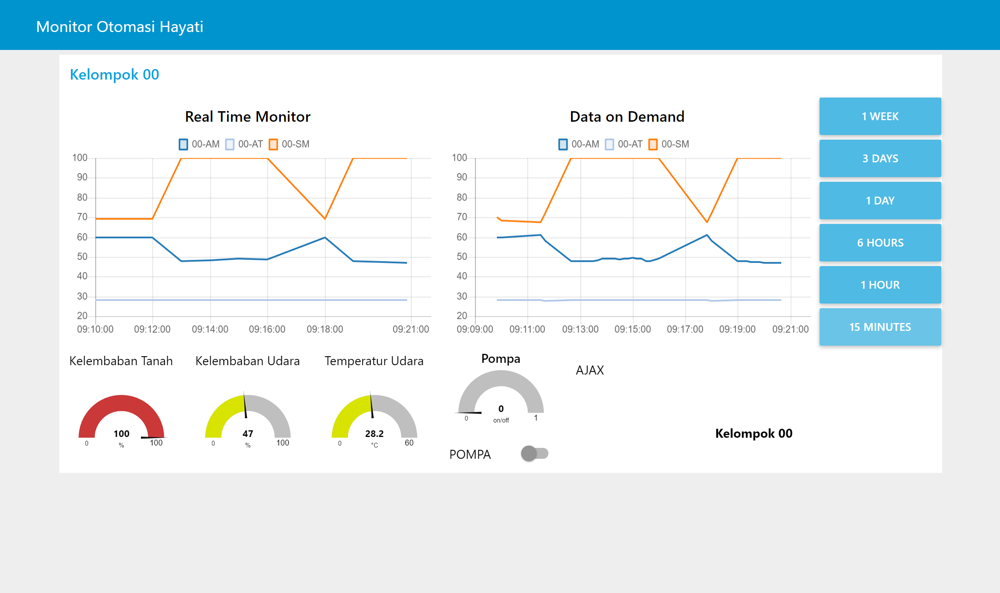

## Architecture

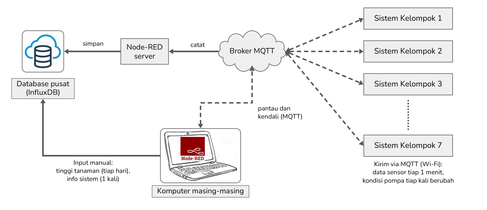

*Each group's device publishes over Wi-Fi to the MQTT broker; a Node-RED flow on the server records the data in InfluxDB; each laptop monitors and controls its device over MQTT and adds manual entries (plant height, system info) to the database. Labels are in Indonesian, as used in the course.*

The same structure as a data-flow diagram:

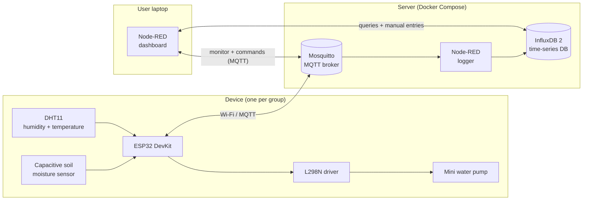

The device publishes; the server-side logger subscribes with a wildcard and writes every group's data into its own measurement, so data is recorded around the clock without any laptop being on.

## Features

- **Closed-loop irrigation.** In automatic mode the pump turns on when calibrated soil moisture drops below a threshold (default 50 %).
- **Manual override.** Mode and pump can be switched remotely over MQTT; pump commands are rejected while in automatic mode.
- **Event-driven reporting.** Sensor data is published every minute; mode and pump state are published only when they change, so watering duration can be computed from the log.
- **Fault reporting.** DHT11 read failures keep the last valid value and are reported once on a status topic; a ping command checks that the device is alive.
- **Multi-device server.** One broker, one database, one logger flow for all groups, separated by a two-digit group number in the topic.
- **Dashboard.** Live gauges, a real-time chart, and a history chart with selectable range (15 minutes to 1 week) using aggregated Flux queries.

## Hardware

| Component | Pin | ESP32 |
|---|---|---|
| Capacitive soil moisture sensor | AOUT | GPIO34 |
| | VCC / GND | 3V3 / GND |
| DHT11 module | OUT | GPIO22 |
| | + / − | 3V3 / GND |
| L298N motor driver | IN1 | GPIO32 |
| | IN2 | GPIO21 |
| | 5V / GND | 5 V adaptor (ground shared with ESP32) |
| Mini submersible pump (3–6 V) | | L298N OUT1 / OUT2 |

Board: ESP32 DevKit, 30 pins, selected as *ESP32 Dev Module* in Arduino IDE.

Sensor connections:

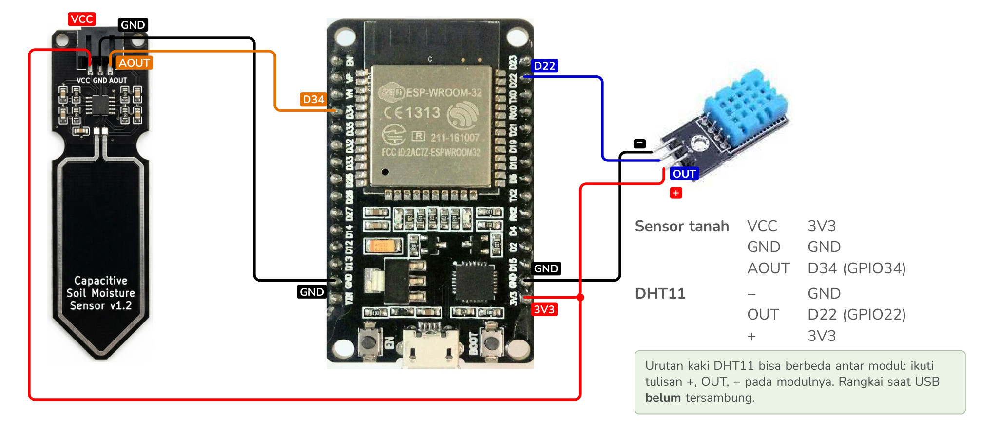

Complete layout on two joined 400-point breadboards, with the pump driver and its 5 V supply:

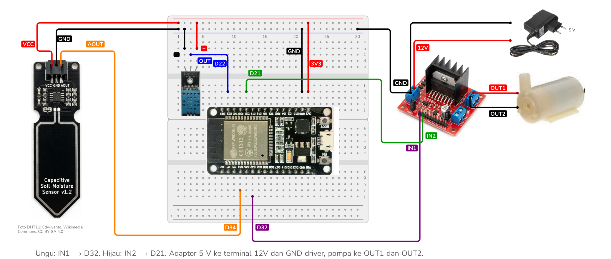

Serial output of the running device (sensor line every second, an incoming ping command and its reply):

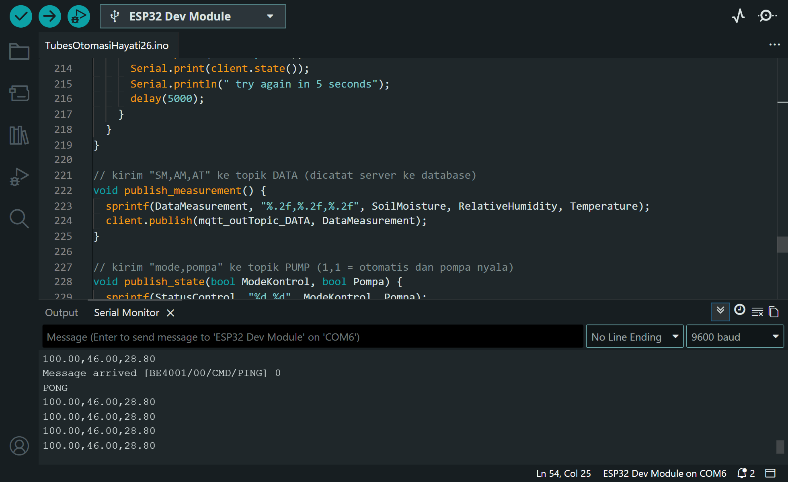

## MQTT interface

`XX` is the two-digit device (group) number.

| Topic | Direction | Payload |
|---|---|---|
| `BE4001/XX/DATA` | device → server | `SM,AM,AT`: soil moisture (%), air humidity (%), air temperature (°C), every minute |
| `BE4001/XX/PUMP` | device → server | `mode,pump`: `1,1` = automatic and pump on; sent on every change |
| `BE4001/XX/DHT` | device → server | DHT11 status, sent when it changes |
| `BE4001/XX/AJAX` | device → server | Free-text messages (connected, command replies, `PONG`) |
| `BE4001/XX/CMD/MODE` | server → device | `1` automatic, `0` manual |
| `BE4001/XX/CMD/PUMP` | server → device | `1` on, `0` off (manual mode only) |
| `BE4001/XX/CMD/PING` | server → device | Any payload; device answers `PONG` and its current state |

## Data model (InfluxDB)

| Measurement | Fields | Written by |
|---|---|---|
| `kel_XX_data` | `SM`, `AM`, `AT`, and `Height` (plant height in mm, entered daily) | server logger; `Height` from the manual-entry flow |
| `kel_XX_pompa` | `mode`, `pompa` | server logger |
| `kel_XX_info` | location, planting and harvest dates, daylight hours, plant type, members | manual-entry flow |

The logger flow on the server subscribes to all groups with a wildcard and names the measurement after the group number in the topic:

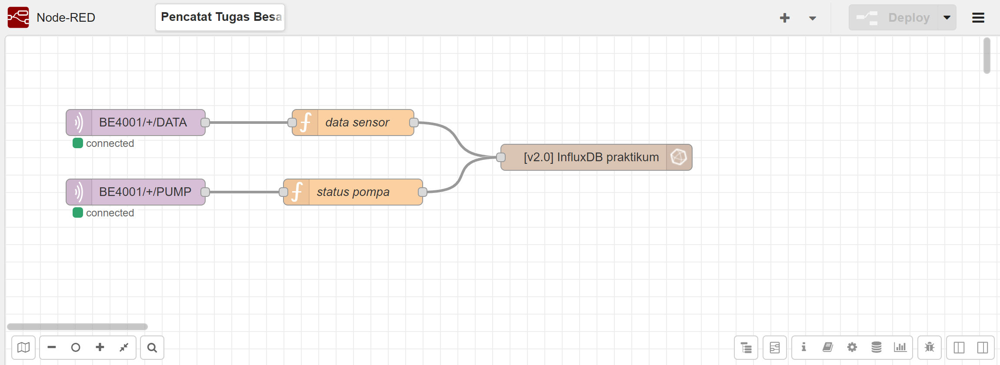

Logged data in the InfluxDB Data Explorer, and the two buckets:

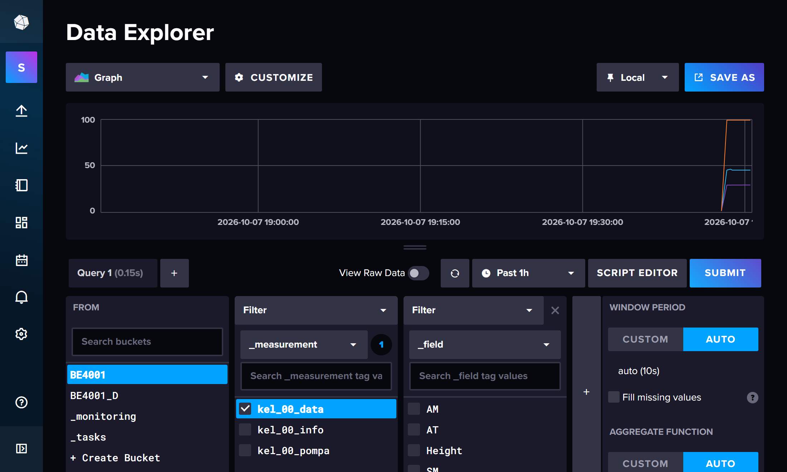

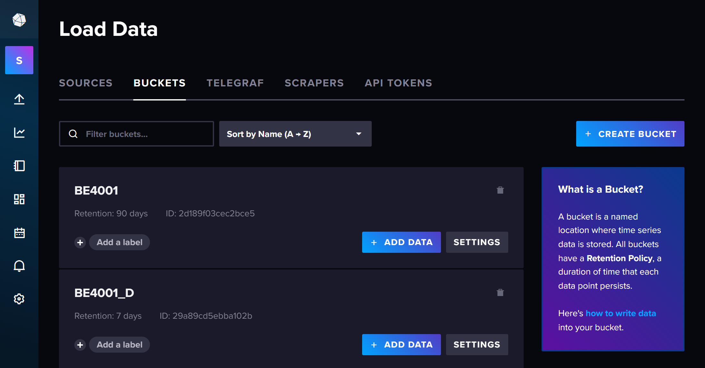

All points carry the tag `kelompok` (group number). Two buckets are used: `BE4001` (90-day retention) for the project and `BE4001_D` (7-day retention) for experiments.

## Repository layout

```
firmware/SmartIrrigation/   ESP32 sketch (Arduino)
server/                     Docker Compose stack: Mosquitto, InfluxDB 2.7, Node-RED logger
  nodered/flow_pencatat.json  logger flow (MQTT -> InfluxDB)
node-red/
  dashboard_flow.json       dashboard: gauges, charts, range buttons, pump switch
  manual_entry_flow.json    system info and daily plant height -> InfluxDB
docs/images/                screenshots
```

Code comments are in Indonesian, as used in the course.

## Running it

### 1. Server

Requires Docker with the Compose plugin.

```bash
cd server
cp .env.example .env        # then edit the passwords and token
./pasang.sh influxdb tubes  # broker + InfluxDB + Node-RED logger
./siapkan_influx.sh         # once: draft bucket, shared user, read/write token
./siapkan_nodered.sh        # once: install the InfluxDB nodes and the logger flow
```

Open ports `1884` (MQTT) and `8086` (InfluxDB). The server's Node-RED editor is bound to `127.0.0.1` and has no password; reach it through an SSH tunnel only.

### 2. Firmware

Install the *DHT sensor library* (Adafruit) and *PubSubClient* in Arduino IDE, then edit the top of `SmartIrrigation.ino`:

- Wi-Fi `ssid` and `password`
- the group number in the eight topics
- `SM_KERING` and `SM_BASAH`, the raw ADC readings of your sensor in air and in water
- `mqtt_server`, `mqttUser`, `mqttPassword`

### 3. Dashboard

In a local Node-RED, install `node-red-dashboard`, `node-red-contrib-influxdb` and `node-red-node-serialport`, import `node-red/dashboard_flow.json`, then fill in the server address, MQTT account and InfluxDB token.

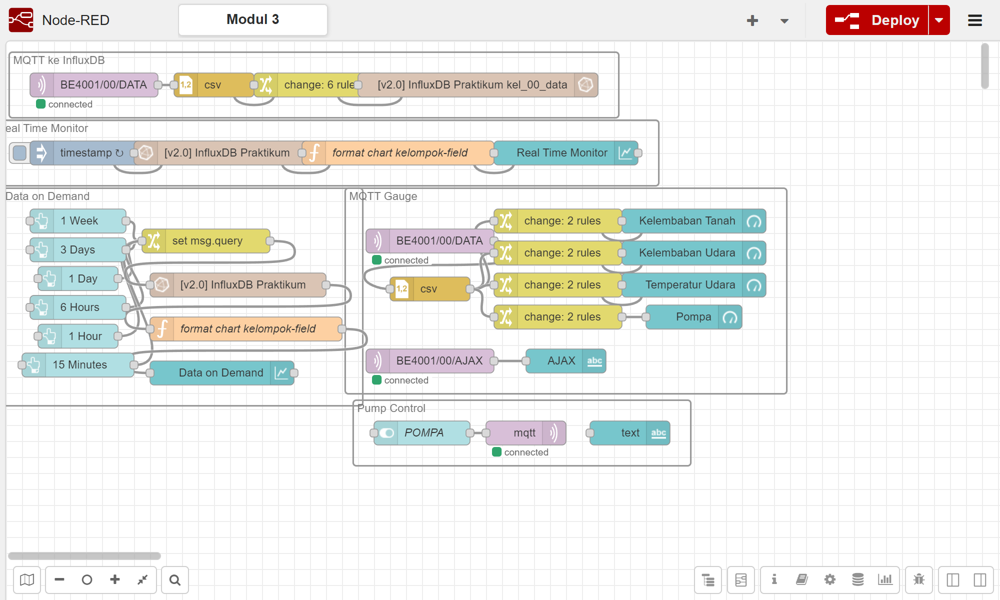

Pump switch and device replies on the dashboard (here the answer to a ping):

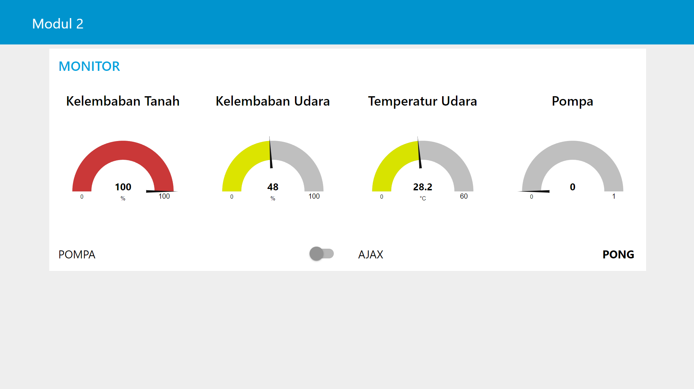

`node-red/manual_entry_flow.json` sends the system info once and the plant height daily:

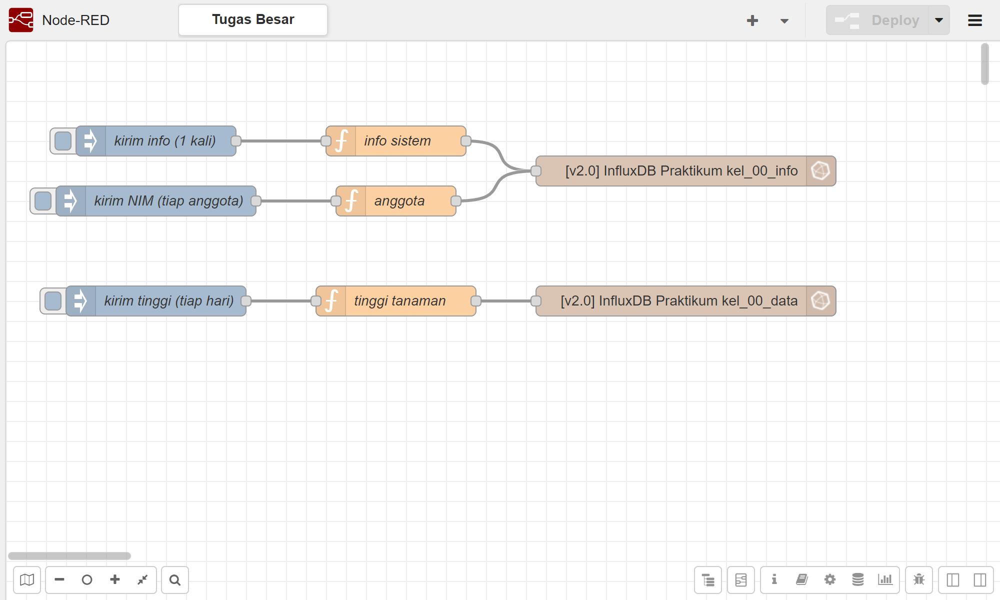

## Known limitations

- `dashboard_flow.json` comes from the third lab session, whose firmware sends pump state as a fourth value on the `DATA` topic. With the final firmware in this repository, pump state arrives on the `PUMP` topic instead, so the dashboard's pump gauge needs to be rewired to that topic.
- The broker uses a shared username and password without TLS, which is acceptable for a classroom but not for a public deployment.
- The pump is driven on/off only; there is no flow measurement or PWM control.

## Image credits

The wiring and architecture drawings are my own, but they embed product photos and icons that belong to their respective owners: the ESP32 DevKit, capacitive soil moisture sensor, L298N driver, pump and adaptor photos come from vendor listings and earlier course slides, and the DHT11 top-view photo is by Edwiyanto (Wikimedia Commons, CC BY-SA 4.0). All screenshots were taken from my own running system.

## Acknowledgements

The practicum concept and earlier versions of the firmware come from previous years of the BE4001 course. For 2026 I redesigned the hardware set (ESP32 DevKit, capacitive soil sensor, L298N), rewrote the firmware and topic scheme, and built the server stack and flows in this repository.
